# MERGING PUSHED CHANGES BY TOM AND JERRY

### 1. Create a Pull Request For Tom's Changes
 - Open a web-broswer and navigate to the github repository.

 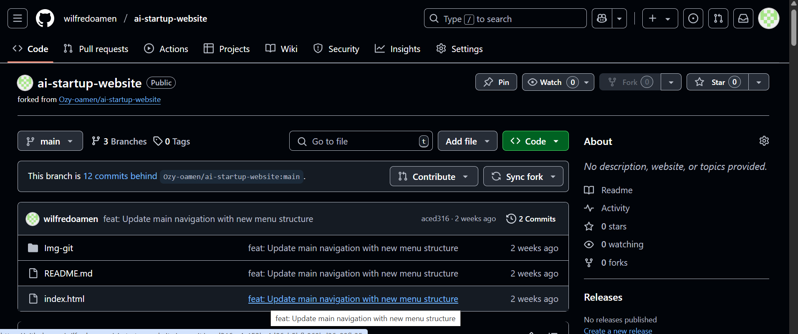

 - Switch to Tom's branch by clicking on the branch dropdown menu and selecting **update-navigation** branch, which is in this case Tom's branch.

 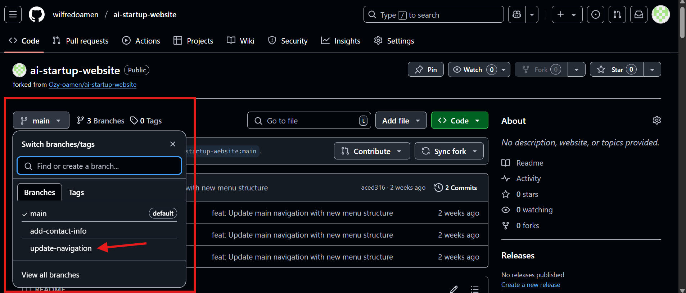

 - Create a new pull request by clicking the dropdown menu **Contribute**, followed by the **Open pull request**. 
   These will automatically select the main project's branch as the base and Tom's recently pushed branch **"update-navigation"** as the compare branch.

   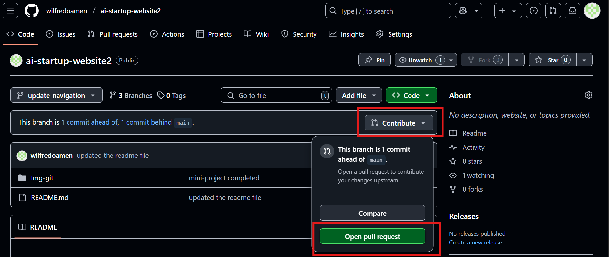

   Since everything look good, after providing a title and description for the pull request, click the **"Create pull request"** button.

   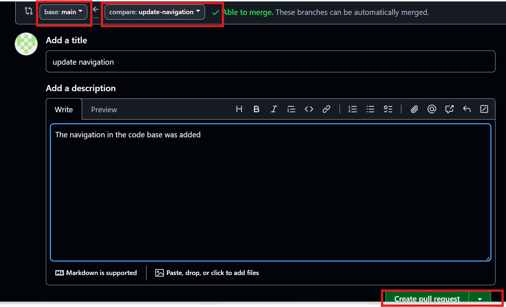

### 2. Review and Merge Tom's Pull Request 

-  Since the pull request is created and now visible to a team member who can review and merge Tom's changes. The team member reviewing Tom's changes approved and merges the pull request, since the term agrees with the changes.

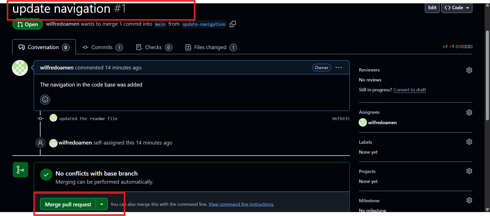

### 3. Updating Jerry's branch with the latest changes

- On the terminal, switch to Jerry's branch using the bash command below.

```bash
git checkout add-contact-info
```
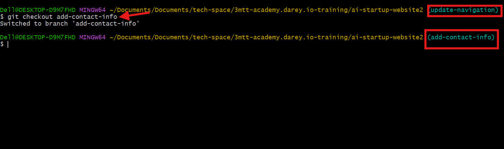

- Pull the latest changes from the main branch by using the bash command below.

```bash
git pull origin main
```
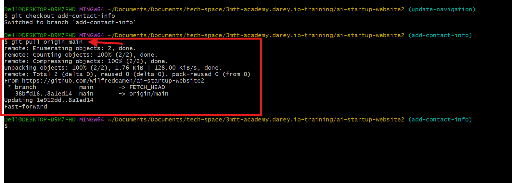


- Jerry updates his part and add his changes to the staging area,as well as commit the changes with a discriptive message of what his has done and finally pushing his changes to the github repository using the following bash commands.

```bash
# Add changes to the staging area
git add .

# Commit changes with a discriptive message
git commit -m "Discriptive-Message"

# Push changes to github repository
git push origin add-contact-info
```

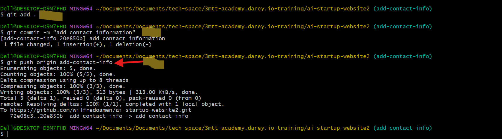


### 4. Create a Pull Request For Jery's Changes
 - Open a web-broswer and navigate to the github repository.

 

 - Switch to Jerry's branch by clicking on the branch dropdown menu and selecting **add-contact-info** branch, which is in this case Jerry's branch.

 

 - Create a new pull request by clicking the dropdown menu **Contribute**, followed by the **Open pull request**. 
   These will automatically select the main project's branch as the base and Jerry's recently pushed branch **"add-contact-info"** as the compare branch.

   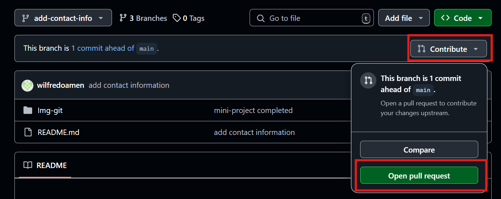

   Since everything look good, after providing a title and description for the pull request, click the **"Create pull request"** button.

   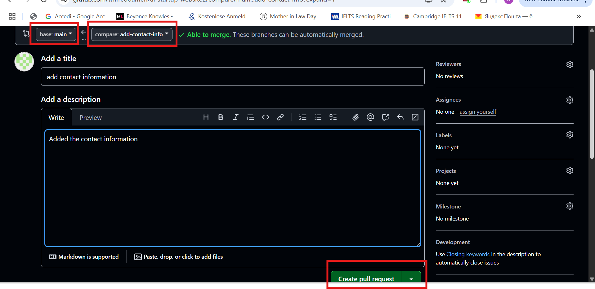

### 5. Review and Merge Jerry's Pull Request 

-  Since the pull request is created and now visible to a team member who can review and merge Jerry's changes. The team member reviewing Jerry's changes approved and merges the pull request, since the term agrees with the changes.

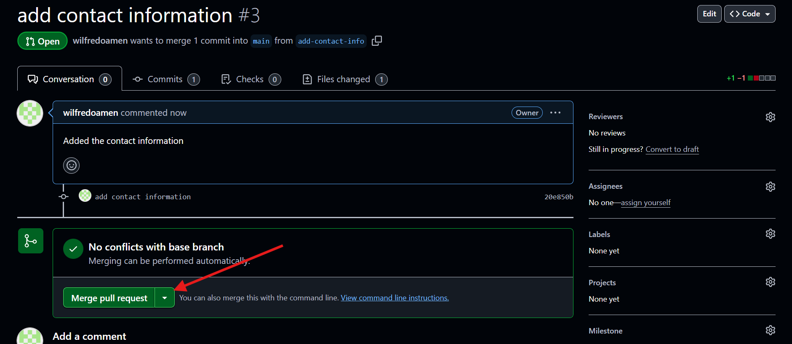


